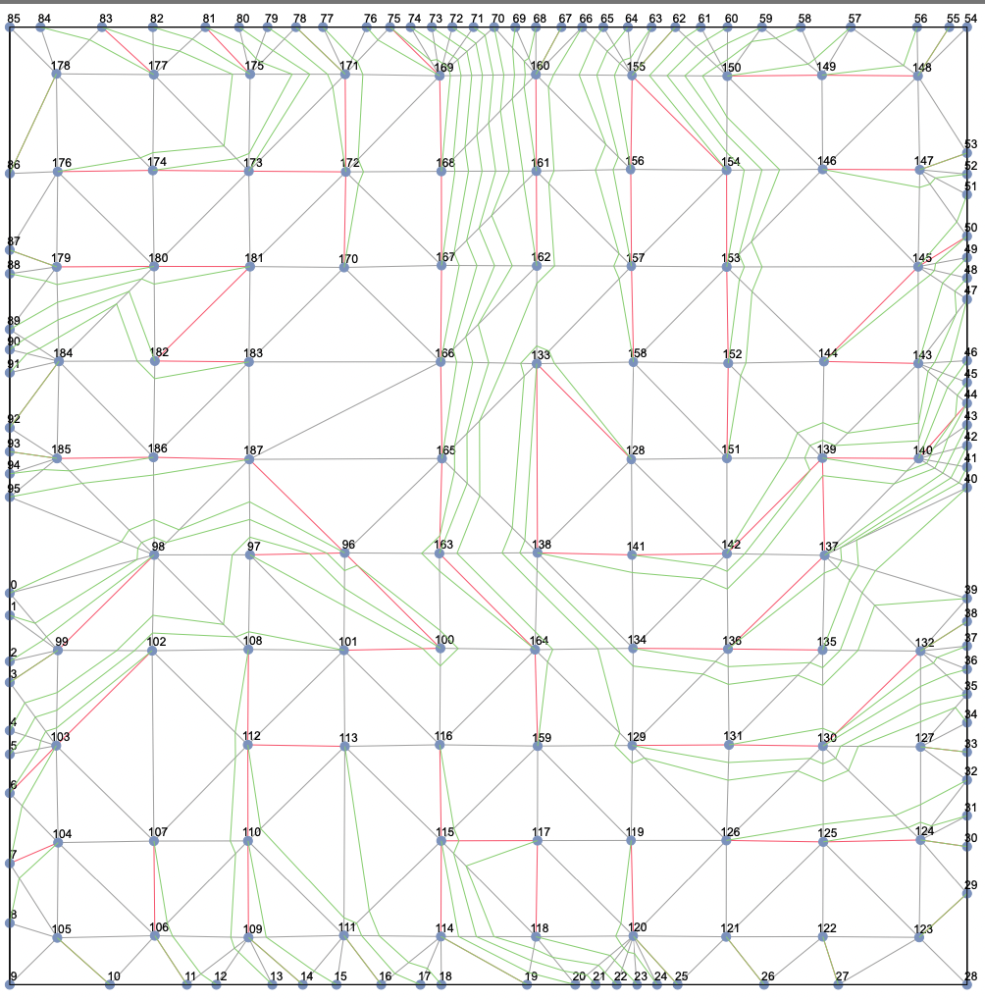

# README

Hello everyone! I am the author of this project, **Yueh-Chang Shieh**, and my advisor is **Dr. Yi-Yu Liu**.  
This project is the implementation of my thesis, **"[Topological Escape Routing for Package Substrate Design Planning](./documentation/_2022__Yueh_chang_Shieh__Topological_Escape_Routing_for_Package_Substrate_Design_Planning.pdf)"**.  
For detailed information, please refer to my thesis.



## Project Contents

```txt
tadpole
├── CMakeLists.txt
├── Io_drc
├── README.html
├── README.md
├── bin
├── build
├── documentation
├── inc
├── result
├── src
├── tags
└── via_info
```

- The project uses **CMake** for compilation. The required dependencies are:
  - [Boost](https://www.boost.org/doc/libs/1_76_0/libs/graph/doc/index.html): Specifically, the **Boost Graph Library**, **Geometry Library**, and **Polygon Library**.
  - [fmt](https://github.com/fmtlib/fmt): Used for formatted output (`std::cout`).
  - [xlsxwriter](http://libxlsxwriter.github.io): Not sure where I used it—maybe it's unnecessary.
  - [Gnuplot 5.2](http://www.gnuplot.info): The geometrical visualization generates a Gnuplot 5 script, so please update to Gnuplot 5.
  - [Python3 library openpyxl](https://openpyxl.readthedocs.io/en/stable/):  
    This is used to automate the generation of an **XLSX file** containing all results.  
    The related files are `./src/experimentw.cpp` and `./src/write_to_xlsx.py`.  
    You can find the generated results in the **result/** directory.

- Key points about the CMake setup:
  - **Source files (`.cpp`)** are in the `src/` directory.
  - **Header files (`.h`)** are in the `inc/` directory.
  - **tags** file is generated by `ctags`, which helps with code navigation—highly recommended.
  - **Input files** are stored in the `Io_drc/` and `via_info/` directories.
  - To compile the project, run the following commands from the `tadpole` directory:

    ```bash
    cmake . -B build
    make -C build
    ```

- **CMake-generated files** will be stored in the `build/` directory.  
  **Executables** will be in the `bin/` directory. To run them, use:

    ```bash
    ./bin/demo_1
    ./bin/experiment2
    ```

- The core implementation is in `./inc/topology.h`.  
  All source files that use it must include:

    ```cpp
    #include <topology.h>
    ```

  To understand how to use it, refer to `./src/experiment2.cpp`,  
  which implements the entire **topology escape routing flow** from my thesis.  
  Start tracing the code from there.

## Developer Notes

- If you want to understand how the **triple list table** is used in my thesis,  
  check out `demo_1.cpp` to `demo_6.cpp`. These demos generate the illustrations in my thesis.  
  Try them out to better understand the core implementation of the triple list table.  

  ⚠ **Warning:** If you encounter a segmentation fault or unexpected results,  
  it is likely due to calling `make_slice` on topology vertices that are not in the same slice.  
  This is **invalid** and leads to undefined behavior.  

  In these demos, the class `syc::topology::model::v_01::sketchable_forest<>`  
  is the actual implementation of the triple list table.  

  - **v_01** refers to the first version.
  - The name may differ from the final thesis due to later revisions.

- Take a look at `./inc/topology.h`.  
  I recommend using **ctags** for code navigation.  
  The right-hand panel in the screenshot below is from the  
  [vim-ctags plugin](https://github.com/webastien/vim-ctags),  
  which displays the generated tags file.

  

  - The implementation is in the `syc::topology` namespace.
  - **v_01** is the first version, where `sketchable_forest` is implemented.
  - Later versions (`v_02`, `v_03`) inherit from this class.
  - **Only v_01 and v_03 are relevant**—you can ignore v_02.

- Other unmentioned files are mostly **temporary files or contain bugs**—feel free to explore them.  
  Due to my **graduation deadline**, some parts of the code are messy—sorry about that! 😅

---

Let me know if you’d like further refinements! 🚀
